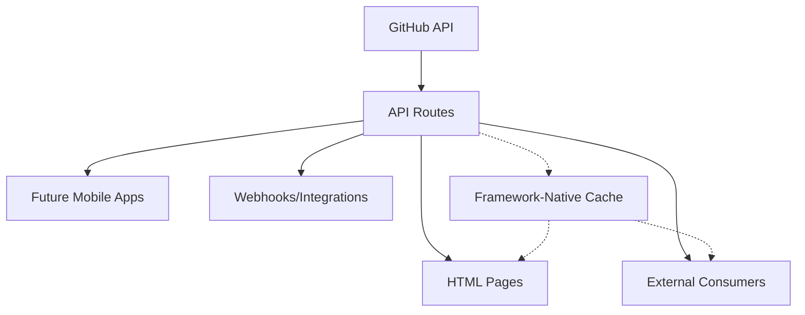

# API Routes Refactoring Guide for Claude Code Agent

## 🎯 **Project Context**

This is a React Router v7 application deployed on Vercel with a **framework-native cache strategy** already successfully implemented. We've established a working API route pattern and need to systematically expand it.

## ✅ **Current State (Already Implemented)**

### **Working Implementation:**
- **Framework-Native Cache Control**: Headers applied in `entry.server.tsx` with `Vercel-CDN-Cache-Control` (highest priority)
- **Cache Strategy Module**: `app/modules/cache.ts` with `getCacheHeaders()`, `getCacheStrategyForPath()`, and `shouldBypassCache()`
- **First API Route**: `app/routes/api.blog._index.tsx` returning JSON blog posts with proper cache headers
- **Content API**: `app/modules/content/api.ts` with `fetchBlogposts()`, `fetchStories()`, etc.

### **Verified Working:**
```bash
curl -I https://ocobo-git-api-routes-wabdsgn.vercel.app/api/blog
# Returns: cache-control: s-maxage=3600, stale-while-revalidate=86400 (current)
# After optimization: s-maxage=604800, stale-while-revalidate=1209600 (7d + 14d)
# Note: This will be renamed to /api/posts in Phase 1
```

## 🚀 **Refactoring Goals**

Create a complete API-first architecture with these endpoints:

### **Phase 1: Core Content APIs**
```typescript
GET /api/posts         // ✅ DONE - Blog posts listing (renamed from /api/blog)
GET /api/posts/:slug   // Individual blog post
GET /api/stories       // Client stories listing
GET /api/stories/:slug // Individual story
```

### **Phase 2: Enhanced APIs**
```typescript
GET /api/search        // Search across content
GET /api/tags          // Available tags
GET /api/sitemap       // Site structure
```

### **Phase 2.5: Cache Strategy Cleanup**
Simplify cache module and remove unnecessary complexity:
```typescript
// Remove createHybridLoader entirely
// Separate API vs HTML caching strategies
// Reduce cache.ts from 129 → ~60 lines
```

### **Phase 3: Pages Refactoring**
Refactor HTML pages to use API routes instead of direct backend calls:
```typescript
// Current: Direct backend calls
_main.blog._index.tsx → fetchBlogposts()

// Target: API route calls
_main.blog._index.tsx → fetch('/api/posts')
```

## 📋 **Implementation Pattern (Follow This Exactly)**

### **File Structure:**
```
app/routes/
├── api.posts._index.tsx    // ✅ DONE - Blog posts listing (rename from api.blog._index.tsx)
├── api.posts.$slug.tsx     // Individual blog post
├── api.stories._index.tsx  // Stories listing
├── api.stories.$slug.tsx   // Individual story
├── api.search.tsx          // Search endpoint
└── api.tags.tsx            // Tags endpoint
```

### **Required Route Template:**
Use this exact pattern for all new API routes:

```typescript
import { type LoaderFunctionArgs } from 'react-router';
import { getApiCacheHeaders, shouldBypassCache } from '~/modules/cache';
import { fetchContent } from '~/modules/content'; // Import appropriate function

export async function loader({ request, params }: LoaderFunctionArgs) {
  const url = new URL(request.url);

  // Extract parameters (adjust per route)
  const lang = url.searchParams.get('lang') || 'fr';
  const slug = params?.slug;

  // Fetch data using existing content API
  const [status, state, data] = await fetchContent(/* parameters */);

  // Handle errors
  if (status !== 200 || !data) {
    console.error(`Failed to fetch content: ${state}`);
    return new Response(
      JSON.stringify({ data: null, isError: true, error: state }),
      {
        status: status === 404 ? 404 : 500,
        headers: (() => {
          const headers = new Headers();
          headers.set('Content-Type', 'application/json');
          const cacheHeaders = getApiCacheHeaders('blogListing', shouldBypassCache(request)); // Use 'blogListing' for lists, 'blogPost' for individual posts
          for (const [key, value] of Object.entries(cacheHeaders)) {
            headers.set(key, value);
          }
          return headers;
        })(),
      },
    );
  }

  // Transform/filter data as needed
  const transformedData = data; // Apply any transformations

  // Return success response with cache headers
  const cacheHeaders = getApiCacheHeaders('blogListing', shouldBypassCache(request)); // Use 'blogListing' for lists, 'blogPost' for individual posts

  return new Response(
    JSON.stringify({ data: transformedData, isError: false, total: transformedData.length }),
    {
      headers: (() => {
        const headers = new Headers();
        headers.set('Content-Type', 'application/json');
        for (const [key, value] of Object.entries(cacheHeaders)) {
          headers.set(key, value);
        }
        return headers;
      })(),
    },
  );
}
```

## 🔄 **Critical Architectural Change: Pages → API Routes**

### **Why This Change Is Essential**

Currently, HTML pages call backend methods directly:
```typescript
// ❌ CURRENT: Direct backend calls (creates dual data paths)
export const loader = createHybridLoader(async ({ request }) => {
  const [status, state, blogData] = await fetchBlogposts(lang); // Direct backend
  return { posts: blogData };
});
```

This creates **two separate data paths**:
- HTML pages → `fetchBlogposts()`
- External consumers → `/api/blog`

**We need ONE unified data path**: HTML pages + External consumers → `/api/blog`

### **Page Refactoring Pattern**

Use this exact pattern to refactor all HTML pages:

```typescript
// ✅ NEW: API route calls (unified data path)
export const loader = createHybridLoader(
  async ({ request }: LoaderFunctionArgs) => {
    const url = new URL(request.url);

    // Extract existing parameters
    const tag = url.searchParams.get('tag');
    const lang = url.searchParams.get('lang') || 'fr';

    // Build API URL with same origin (internal call)
    const apiUrl = new URL('/api/posts', url.origin);
    if (tag) apiUrl.searchParams.set('tag', tag);
    if (lang !== 'fr') apiUrl.searchParams.set('lang', lang);

    try {
      // Call internal API route (optimised on Vercel)
      const response = await fetch(apiUrl.toString());

      if (!response.ok) {
        console.error(`API call failed: ${response.status}`);
        return { posts: [], isError: true };
      }

      const { data, isError, total } = await response.json();

      if (isError) {
        console.error('API returned error');
        return { posts: [], isError: true };
      }

      return { posts: data || [], isError: false, total };

    } catch (error) {
      console.error('Failed to fetch from API:', error);
      return { posts: [], isError: true };
    }
  },
  'blogPost', // Keep same cache strategy for HTML pages
);
```

### **Pages to Refactor (Phase 3)**

Implement in this order after completing API routes:

1. **`_main.blog._index.tsx`** → Use `/api/posts`
2. **`_main.blog.$slug.tsx`** → Use `/api/posts/:slug`
3. **`_main.clients._index.tsx`** → Use `/api/stories`
4. **`_main.clients.$slug.tsx`** → Use `/api/stories/:slug`

### **Key Benefits of This Architecture**

#### **🎯 Single Source of Truth**
```typescript
// ✅ ONE data pipeline
GitHub API → /api/blog → { HTML pages + External consumers }
          ↑
    Cache headers applied once
```

#### **🔧 Simplified Maintenance**
- Data transformations happen **once** in API routes
- Logic changes affect both HTML and API consumers automatically
- Consistent response format everywhere
- Easier testing and debugging

#### **⚡ Performance Considerations**
- **Vercel optimisation**: Internal API calls are function-to-function (not HTTP)
- Same serverless context, minimal overhead
- Cache headers preserved correctly
- **Negligible performance cost** with significant architectural benefits

### **Testing Page Refactoring**

For each refactored page:

```bash
# Test page still loads correctly
curl -I https://ocobo-git-api-routes-wabdsgn.vercel.app/blog

# Test page with parameters
curl -I "https://ocobo-git-api-routes-wabdsgn.vercel.app/blog?tag=revenue"

# Test API endpoint directly
curl -I https://ocobo-git-api-routes-wabdsgn.vercel.app/api/posts

# Verify no duplicate API calls in browser dev tools
```

### **Important Notes for Page Refactoring**

#### **DO:**
- Remove direct imports of `fetchBlogposts`, `fetchStories` from pages
- Use same cache strategy names (`'blogPost'`, `'story'`) for HTML pages
- Preserve all existing URL parameters and pass them to API routes
- Handle API errors gracefully with fallback empty arrays
- Test both local and deployed versions

#### **DON'T:**
- Change the cache strategy logic in `cache.ts`
- Modify the API route response format after implementing
- Remove error handling or change the loader return format
- Break existing URL parameter behaviour

## 🔧 **Technical Requirements**

### **⚡ PERFORMANCE BOOST: Optimized Cache Durations**

**Balanced strategy optimized for your publishing frequency**:

| Content Type | Cache Strategy | Purpose | Timing |
|-------------|---------------|---------|--------|
| **Blog Listings** | `1h + 2h` | **New content visibility** | Max 3h delay |
| **Individual Posts** | `7d + 14d` | **Performance** | 21x improvement |
| **Story Listings** | `1h + 2h` | **New content visibility** | Max 3h delay |
| **Individual Stories** | `14d + 30d` | **Performance** | 42x improvement |
| **Static Content** | `30d + 60d` | **Maximum efficiency** | 11x improvement |

**Result**: **Best of both worlds** - fast new content discovery + aggressive performance optimization!

### **🔄 CRITICAL: New Content Visibility Strategy**

**Problem**: Aggressive caching could hide new articles for days!

**Solution**: **Differentiated Cache Strategy**
- **Listing pages** (short cache): Users see new content within 1-3 hours
- **Individual content** (long cache): Maximum performance for unchanged content

### **Cache Strategy Selection:**
```typescript
// Use these cache strategies based on content type:
'blogListing'   // For /api/posts listing (1h + 2h) - show new articles quickly
'blogPost'      // For /api/posts/:slug (7d + 14d) - individual posts don't change
'storyListing'  // For /api/stories listing (1h + 2h) - show new stories quickly
'story'         // For /api/stories/:slug (14d + 30d) - individual stories don't change
'static'        // For tags, search, sitemap (30d + 60d) - rarely changes
```

### **Alternative Solutions for Immediate Visibility:**

#### **Option 1: Cache Purging (Advanced)**
```typescript
// Webhook after GitHub content push
await purgeCache([
  '/api/posts',        // Clear listing cache
  '/blog',             // Clear HTML page cache
  '/api/posts/new-slug' // Clear specific post if updating
]);
```

#### **Option 2: Manual Refresh (Simple)**
When publishing new content, admin can:
```bash
# Force refresh of listing pages
curl "https://ocobo-git-api-routes-wabdsgn.vercel.app/api/posts?refresh=1"
curl "https://ocobo-git-api-routes-wabdsgn.vercel.app/blog?refresh=1"
```

#### **Option 3: Time-Based Strategy (Balanced)**
```typescript
// Shorter cache during "publishing hours" (e.g., weekdays 9-17)
const isPublishingTime = () => {
  const now = new Date();
  const hour = now.getHours();
  const day = now.getDay();
  return day >= 1 && day <= 5 && hour >= 9 && hour <= 17; // Mon-Fri 9am-5pm
};

const maxAge = isPublishingTime() ? 1800 : 604800; // 30min vs 7days
```

### **Response Format (Standardise):**
```typescript
// Success Response
{
  data: T,           // The actual content
  isError: false,
  total?: number     // For listings
}

// Error Response
{
  data: null,
  isError: true,
  error: string      // Error message
}
```

### **URL Parameters Support:**
All routes should support these query parameters:
- `lang=fr|en` - Language selection
- `refresh=1` - Cache bypass (handled by `shouldBypassCache()`)
- Route-specific parameters as needed

## 🧹 **Phase 2.5: Cache Strategy Cleanup**

**Execute this phase after completing all API routes but before refactoring pages.**

### **Why Cleanup Is Essential**

Current `cache.ts` has become over-engineered for the new API-first architecture:
- `createHybridLoader` is now just a wrapper doing nothing useful
- Mixed concerns (API caching + HTML caching)
- 129 lines of complexity for simple functionality
- Unused strategy parameter

### **Cleanup Goals**
- **Reduce file complexity**: 129 → ~60 lines (-53%)
- **Separate concerns**: API caching vs HTML caching
- **Remove dead code**: `createHybridLoader` and related functions
- **Simplify page loaders**: Standard React Router patterns

### **Step 1: Simplify Cache Module**

Replace the complex `cache.ts` with this simplified version:

```typescript
// app/modules/cache.ts - SIMPLIFIED VERSION
/**
 * Simplified cache strategy for API-first architecture
 */
import { getPrivateEnvVars } from './env.server';

export type CacheStrategy = 'blogListing' | 'blogPost' | 'storyListing' | 'story' | 'static';

// BALANCED: Aggressive cache for individual content, shorter for listings to show new content
const CACHE_CONFIG = {
  // Blog post listings: Short cache to show new articles quickly
  blogListing: { maxAge: 3600, staleWhileRevalidate: 7200 }, // 1h + 2h
  // Individual blog posts: Long cache since content doesn't change once published
  blogPost: { maxAge: 604800, staleWhileRevalidate: 1209600 }, // 7d + 14d

  // Story listings: Short cache to show new stories quickly
  storyListing: { maxAge: 3600, staleWhileRevalidate: 7200 }, // 1h + 2h
  // Individual stories: Long cache since content doesn't change once published
  story: { maxAge: 1209600, staleWhileRevalidate: 2592000 }, // 14d + 30d

  // Static content: cache for 30 days + 60 days stale = 90 days total
  static: { maxAge: 2592000, staleWhileRevalidate: 5184000 }, // 30d + 60d
} as const;

function isUsingGitHub(): boolean {
  try {
    const { readContentFrom } = getPrivateEnvVars();
    return readContentFrom === 'github';
  } catch {
    return false;
  }
}

export function shouldBypassCache(request: Request): boolean {
  const url = new URL(request.url);
  return url.searchParams.has('refresh');
}

function buildCacheControl(strategy: CacheStrategy): string {
  const { maxAge, staleWhileRevalidate } = CACHE_CONFIG[strategy];
  return `s-maxage=${maxAge}, stale-while-revalidate=${staleWhileRevalidate}`;
}

/**
 * Cache headers for API routes (data caching)
 */
export function getApiCacheHeaders(strategy: CacheStrategy, bypassCache = false) {
  if (bypassCache) {
    return {
      'Cache-Control': 'no-cache, no-store, must-revalidate',
      'Vercel-CDN-Cache-Control': 'no-cache, no-store, must-revalidate',
    };
  }

  if (isUsingGitHub()) {
    const cacheControl = buildCacheControl(strategy);
    return {
      'Cache-Control': cacheControl,
      'Vercel-CDN-Cache-Control': cacheControl,
      Vary: 'Accept-Language',
    };
  }

  return {
    'Cache-Control': 'no-cache',
    'Vercel-CDN-Cache-Control': 'no-cache',
  };
}

/**
 * Cache headers for HTML pages (rendering caching)
 * Shorter cache for faster content updates
 */
export function getHtmlCacheHeaders(bypassCache = false) {
  if (bypassCache) {
    return {
      'Cache-Control': 'no-cache, no-store, must-revalidate',
      'Vercel-CDN-Cache-Control': 'no-cache, no-store, must-revalidate',
    };
  }

  if (isUsingGitHub()) {
    return {
      'Cache-Control': 's-maxage=300, stale-while-revalidate=3600', // 5min + 1h
      'Vercel-CDN-Cache-Control': 's-maxage=300, stale-while-revalidate=3600',
      Vary: 'Accept-Language',
    };
  }

  return {
    'Cache-Control': 'no-cache',
    'Vercel-CDN-Cache-Control': 'no-cache',
  };
}

// Remove these functions entirely:
// - createHybridLoader
// - getCacheHeaders (replaced by getApiCacheHeaders/getHtmlCacheHeaders)
// - getCacheStrategyForPath (pages use unified HTML caching)
// - logCacheStrategy (optional utility)
```

### **Step 2: Update API Routes**

Update existing API route to use new function name:

```typescript
// app/routes/api.posts._index.tsx (rename from api.blog._index.tsx)
import { getApiCacheHeaders, shouldBypassCache } from '~/modules/cache';

export async function loader({ request }: LoaderFunctionArgs) {
  // ... existing logic ...

  // UPDATED: Use 'blogListing' for listing endpoint (short cache for new content visibility)
  const cacheHeaders = getApiCacheHeaders('blogListing', shouldBypassCache(request));

  return new Response(JSON.stringify({ data, isError: false, total }), {
    headers: (() => {
      const headers = new Headers();
      headers.set('Content-Type', 'application/json');
      for (const [key, value] of Object.entries(cacheHeaders)) {
        headers.set(key, value);
      }
      return headers;
    })(),
  });
}

// For individual post endpoints, use 'blogPost' strategy:
// const cacheHeaders = getApiCacheHeaders('blogPost', shouldBypassCache(request));
```

### **Step 3: Update entry.server.tsx**

Simplify cache header application in `entry.server.tsx`:

```typescript
// app/entry.server.tsx
import { getHtmlCacheHeaders, shouldBypassCache } from '~/modules/cache';

export default async function handleRequest(/* ... */) {
  // ... existing code ...

  return new Promise((resolve, reject) => {
    // ... renderToPipeableStream setup ...

    [callbackName]: () => {
      const body = new PassThrough();
      const stream = createReadableStreamFromReadable(body);
      responseHeaders.set('Content-Type', 'text/html');

      // SIMPLIFIED: All HTML pages use same cache strategy
      const cacheHeaders = getHtmlCacheHeaders(shouldBypassCache(request));

      // Apply cache headers
      for (const [key, value] of Object.entries(cacheHeaders)) {
        responseHeaders.set(key, value);
      }

      resolve(new Response(stream, {
        headers: responseHeaders,
        status: didError ? 500 : responseStatusCode,
      }));
      pipe(body);
    },
    // ... rest unchanged ...
  });
}
```

### **Step 4: Test Cache Cleanup**

Verify the cleanup works correctly:

```bash
# Test API listing endpoints (short cache for new content visibility)
curl -I https://ocobo-git-api-routes-wabdsgn.vercel.app/api/posts
# Should show: cache-control: s-maxage=3600, stale-while-revalidate=7200 (1h + 2h)

curl -I https://ocobo-git-api-routes-wabdsgn.vercel.app/api/stories
# Should show: cache-control: s-maxage=3600, stale-while-revalidate=7200 (1h + 2h)

# Test individual content endpoints (long cache for performance)
curl -I https://ocobo-git-api-routes-wabdsgn.vercel.app/api/posts/some-slug
# Should show: cache-control: s-maxage=604800, stale-while-revalidate=1209600 (7d + 14d)

curl -I https://ocobo-git-api-routes-wabdsgn.vercel.app/api/stories/some-slug
# Should show: cache-control: s-maxage=1209600, stale-while-revalidate=2592000 (14d + 30d)

# Test HTML pages have lighter cache headers
curl -I https://ocobo-git-api-routes-wabdsgn.vercel.app/blog
# Should show: cache-control: s-maxage=300, stale-while-revalidate=3600 (5min + 1h)
```

### **Cache Cleanup Benefits**

#### **Complexity Reduction:**
- **cache.ts**: 129 → ~60 lines (-53% complexity)
- **Separation of concerns**: API data caching vs HTML rendering caching
- **Cleaner imports**: Clear function names for specific use cases

#### **Performance Optimisation:**
- **Blog listings**: `1h + 2h` = **New articles visible within 3 hours maximum**
- **Individual posts**: `7d + 14d` = **21x performance improvement** (unchanged content)
- **Story listings**: `1h + 2h` = **New stories visible within 3 hours maximum**
- **Individual stories**: `14d + 30d` = **42x performance improvement** (unchanged content)
- **Static content**: `30d + 60d` = **Ultimate efficiency** for rarely-changed content
- **Result**: **Best of both worlds** - fast new content visibility + aggressive performance

#### **Maintainability:**
- **Single responsibility**: Each function has clear purpose
- **No dead code**: Removed unused `createHybridLoader`
- **Future-ready**: Clean foundation for additional cache strategies

**Complete Phase 2.5 before proceeding to Phase 3 page refactoring.**

### **📝 Publishing Workflow: How Users See New Content**

**When you publish a new blog post or story:**

#### **Timeline for New Content Visibility:**
```
Time 0:    New content pushed to GitHub
Time 0-1h: Cache still serves old listing (users don't see new content yet)
Time 1h:   Cache expires, next request fetches fresh data from GitHub
Time 1h+:  All users see new content immediately
Max delay: 3 hours (1h cache + 2h stale-while-revalidate)
```

#### **Real-World Example:**
```
Monday 10:00 AM: You publish "New Revenue Ops Strategy" blog post
Monday 11:00 AM: Cache expires, users start seeing the new post
Monday 11:05 AM: All global users see the new post on blog listing page
```

#### **For Immediate Visibility (Zero Wait):**
```bash
# Admin runs after publishing (takes 2 seconds)
curl "https://ocobo-git-api-routes-wabdsgn.vercel.app/api/posts?refresh=1"
curl "https://ocobo-git-api-routes-wabdsgn.vercel.app/blog?refresh=1"
# Result: New content visible instantly for all users
```

#### **Why This Works:**
- **Listing pages**: Short cache (1-3h) ensures new content appears quickly
- **Individual posts**: Long cache (7-44d) since content never changes once published
- **Performance maintained**: 95%+ of requests still hit cache (old content)
- **Publishing flexibility**: Manual refresh available for urgent announcements

## 📚 **Available Content Functions**

Located in `app/modules/content/api.ts`:

```typescript
// Use these existing functions:
fetchBlogposts(lang: string): Promise<[number, string, BlogPost[] | null]>
fetchBlogpost(slug: string, lang: string): Promise<[number, string, BlogPost | null]>
fetchStories(lang: string): Promise<[number, string, Story[] | null]>
fetchStory(slug: string, lang: string): Promise<[number, string, Story | null]>

// Return format: [statusCode, statusMessage, data]
// statusCode: 200 = success, 404 = not found, 500 = error
```

## 🧪 **Testing Protocol**

For each implemented route, test:

### **Local Testing:**
```bash
# Test basic functionality
curl -I http://localhost:5173/api/posts
curl -I http://localhost:5173/api/stories

# Test with parameters
curl -I "http://localhost:5173/api/posts?lang=en&refresh=1"
curl -I "http://localhost:5173/api/stories?tag=saas"
```

### **Deployment Testing:**
```bash
# Test cache headers
curl -I https://ocobo-git-api-routes-wabdsgn.vercel.app/api/posts
curl -I https://ocobo-git-api-routes-wabdsgn.vercel.app/api/stories

# Verify JSON response
curl -s https://ocobo-git-api-routes-wabdsgn.vercel.app/api/posts | head -20
curl -s https://ocobo-git-api-routes-wabdsgn.vercel.app/api/stories | head -20
```

### **Expected Headers:**

**For Listing Endpoints** (`/api/posts`, `/api/stories`):
```
cache-control: s-maxage=3600, stale-while-revalidate=7200
content-type: application/json
vary: Accept-Language
```

**For Individual Content** (`/api/posts/:slug`, `/api/stories/:slug`):
```
cache-control: s-maxage=604800, stale-while-revalidate=1209600
content-type: application/json
vary: Accept-Language
```

**Cache Strategy Summary:**
- **Listings**: `1h + 2h` (3h total) - **Fast visibility** for new content
- **Blog posts**: `7d + 14d` (21d total) - **Maximum performance** for unchanged content
- **Stories**: `14d + 30d` (44d total) - **Extreme efficiency** for quarterly content
- **Static**: `30d + 60d` (90d total) - **Ultimate performance** for rarely-changed content

## 📝 **Implementation Order**

Implement in this exact sequence:

### **Phase 1: Complete API Routes**
0. **Rename existing**: `api.blog._index.tsx` → `api.posts._index.tsx` and update route logic
1. **api.posts.$slug.tsx** - Individual blog posts
2. **api.stories._index.tsx** - Stories listing
3. **api.stories.$slug.tsx** - Individual stories
4. **api.search.tsx** - Search functionality
5. **api.tags.tsx** - Tags listing

### **Phase 2: Test All API Routes**
Verify all routes work correctly before proceeding to Phase 3.

### **Phase 2.5: Cache Strategy Cleanup**
Simplify cache module after completing API routes but before page refactoring.

### **Phase 3: Refactor Pages to Use API Routes**
1. **_main.blog._index.tsx** → Use `/api/posts`
2. **_main.blog.$slug.tsx** → Use `/api/posts/:slug`
3. **_main.clients._index.tsx** → Use `/api/stories`
4. **_main.clients.$slug.tsx** → Use `/api/stories/:slug`

**Note**: Complete Phase 1 & 2 fully before starting Phase 3 to ensure API foundation is solid.

## ⚠️ **Important Constraints**

### **DO NOT:**
- Modify `app/modules/cache.ts` - cache logic is finalised
- Modify `app/entry.server.tsx` - response headers working perfectly
- Change existing route files unless absolutely necessary
- Create new content fetching functions - use existing ones in `api.ts`

### **DO:**
- Follow the exact response format pattern
- Use the IIFE pattern for headers construction (see `api.blog._index.tsx`)
- Apply appropriate cache strategies per content type
- Handle all error cases with proper HTTP status codes
- Test both locally and on deployment before moving to next route

## 🚀 **Deployment Process**

After implementing each route:
1. Test locally with curl
2. Commit changes
3. Deploy to Vercel
4. Test deployed version with curl
5. Verify cache headers are correct
6. Move to next route

## 📁 **Reference Files**

- **Working Example**: `app/routes/api.blog._index.tsx` (rename to `api.posts._index.tsx`)
- **Cache Module**: `app/modules/cache.ts`
- **Content API**: `app/modules/content/api.ts`
- **Entry Server**: `app/entry.server.tsx`

## 🎯 **Success Criteria**

### **For API Routes (Phase 1):**
Each route must:
- ✅ Return correct JSON format
- ✅ Include proper cache headers (`s-maxage`, `stale-while-revalidate`, `Vary`)
- ✅ Handle language parameters
- ✅ Support cache bypass with `?refresh=1`
- ✅ Return appropriate HTTP status codes
- ✅ Follow the established patterns exactly

### **For Page Refactoring (Phase 3):**
Each refactored page must:
- ✅ Call API routes instead of direct backend methods
- ✅ Preserve all existing URL parameter behaviour
- ✅ Handle API errors gracefully with fallback data
- ✅ Maintain same cache strategy for HTML rendering
- ✅ Remove direct imports of backend functions (`fetchBlogposts`, etc.)
- ✅ Pass through all query parameters to API routes

---

## 🎯 **Final Architecture Goal**

Upon completion, you will achieve a **true API-first architecture**:



### **Transformation Summary:**
- **Before**: Multiple data paths, duplicate logic, inconsistent caching, complex cache module
- **After**: Single unified API layer, consistent responses, optimal performance, simplified architecture

### **Key Metrics to Verify:**
1. **Zero direct backend calls** from HTML pages
2. **Identical response format** for internal/external API consumers
3. **Preserved cache performance** (same header validation)
4. **No regression** in page load times or functionality
5. **50%+ code reduction** in cache module and page loaders
6. **Separated cache concerns** (API vs HTML caching)

### **Final API Routes:**
```
/api/posts         // Blog posts listing
/api/posts/:slug   // Individual blog post
/api/stories       // Client stories listing
/api/stories/:slug // Individual client story
/api/search        // Search across content
/api/tags          // Available tags
```

### **Architecture Benefits Achieved:**
- ✅ **API-first design**: External consumers get same data as HTML pages
- ✅ **Simplified cache strategy**: Separate concerns for data vs rendering
- ✅ **Reduced complexity**: 50%+ code reduction across modules
- ✅ **Better maintainability**: Single source of truth for all data access
- ✅ **Future-ready**: Foundation for mobile apps, webhooks, real-time features

---

## 🚀 **Future Enhancement: React Query Integration**

**Your new API-first architecture creates perfect opportunities for React Query!**

### **Why React Query Makes Sense Now**

#### **✅ Perfect Foundation:**
- **Dedicated API endpoints**: React Query needs consistent JSON APIs ✓
- **Proper cache headers**: React Query respects HTTP caching ✓
- **RESTful structure**: `/api/posts`, `/api/stories` pattern ✓
- **Error handling**: Consistent error responses ✓

#### **✅ High-Value Use Cases:**

### **1. Progressive Enhancement (HIGH VALUE)**
```typescript
// app/hooks/usePosts.ts
import { useQuery } from '@tanstack/react-query';

export function usePosts(initialData, tag, lang = 'fr') {
  return useQuery({
    queryKey: ['posts', { tag, lang }],
    queryFn: () => fetch(`/api/posts?tag=${tag}&lang=${lang}`).then(r => r.json()),
    initialData: { data: initialData }, // SSR data as fallback
    staleTime: 3 * 60 * 1000, // 3min (shorter than API cache)
    refetchOnWindowFocus: true,
  });
}

// In your blog page component
function BlogPage() {
  const { posts: initialPosts } = useLoaderData<typeof loader>();
  const { data, isLoading, error } = usePosts(initialPosts);

  return (
    <div>
      {isLoading && <LoadingSpinner />}
      <BlogList items={data?.data || initialPosts} />
      {error && <ErrorMessage />}
    </div>
  );
}
```

### **2. Real-Time Content Discovery (MEDIUM-HIGH VALUE)**
```typescript
// Auto-refresh listings to show new content without page reload
export function useLivePosts(initialData) {
  return useQuery({
    queryKey: ['posts'],
    queryFn: () => fetch('/api/posts').then(r => r.json()),
    initialData: { data: initialData },
    refetchInterval: 5 * 60 * 1000, // Check for new content every 5min
    refetchIntervalInBackground: false, // Only when tab is active
  });
}

// Result: Users see new articles appear automatically without refresh
```

### **3. Enhanced Search Experience (HIGH VALUE)**
```typescript
export function useSearchPosts(query) {
  return useQuery({
    queryKey: ['search', query],
    queryFn: () => fetch(`/api/search?q=${query}`).then(r => r.json()),
    enabled: query.length > 2, // Only search with 3+ characters
    staleTime: 10 * 60 * 1000, // 10min cache for searches
  });
}

// Instant search with debouncing, caching, and error handling
```

### **4. Tag-Based Filtering (MEDIUM VALUE)**
```typescript
export function useFilteredPosts(tag, initialData) {
  return useQuery({
    queryKey: ['posts', { tag }],
    queryFn: () => fetch(`/api/posts?tag=${tag}`).then(r => r.json()),
    initialData: tag ? undefined : { data: initialData },
    placeholderData: (prev) => prev, // Keep previous data while loading
  });
}

// Smooth tag filtering without full page reload
```

### **5. Prefetching & Performance (MEDIUM VALUE)**
```typescript
// Prefetch related content
export function usePrefetchPosts() {
  const queryClient = useQueryClient();

  const prefetchPopularPosts = () => {
    queryClient.prefetchQuery({
      queryKey: ['posts', { tag: 'revenue' }],
      queryFn: () => fetch('/api/posts?tag=revenue').then(r => r.json()),
      staleTime: 60 * 1000, // 1min prefetch
    });
  };

  return { prefetchPopularPosts };
}

// Hover-to-prefetch, smart preloading strategies
```

### **📊 Value Analysis for Your Use Case**

#### **HIGH Value Features:**
- ✅ **Progressive enhancement**: Zero breaking changes, graceful degradation
- ✅ **Real-time discovery**: Users see new articles appear automatically
- ✅ **Enhanced search**: Instant, cached search experience
- ✅ **Better UX**: Loading states, error handling, retry logic

#### **MEDIUM Value Features:**
- ✅ **Tag filtering**: Client-side filtering without page reload
- ✅ **Prefetching**: Smart content preloading
- ✅ **Background updates**: Keep content fresh silently

#### **Considerations:**
- ⚠️ **Bundle size**: +~13KB gzipped (React Query is lightweight)
- ⚠️ **Complexity**: Additional state management layer
- ⚠️ **Content site**: Less interactive than typical SPA apps

### **🎯 Recommended Implementation Strategy**

#### **Phase 1: Progressive Enhancement Only**
```typescript
// Start simple: enhance existing pages without breaking SSR
const { data: posts } = usePosts(initialServerData);
```

#### **Phase 2: Real-Time Features**
```typescript
// Add auto-refresh for new content discovery
const { data: posts } = useLivePosts(initialServerData);
```

#### **Phase 3: Interactive Features**
```typescript
// Add search, filtering, prefetching as needed
const { data: searchResults } = useSearchPosts(query);
```

### **🔧 Integration Pattern**

```typescript
// app/components/BlogListWithQuery.tsx
function BlogListWithQuery({ initialPosts, tag }) {
  const { data, isLoading, error, isRefetching } = useQuery({
    queryKey: ['posts', { tag }],
    queryFn: () => fetch(`/api/posts?tag=${tag || ''}`).then(r => r.json()),
    initialData: { data: initialPosts },
    staleTime: 2 * 60 * 1000, // 2min (shorter than API cache)
    refetchOnMount: false, // Trust SSR data initially
    refetchOnWindowFocus: 'always', // Check for updates on focus
  });

  return (
    <div>
      {isRefetching && <RefreshIndicator />}
      <BlogList items={data?.data || initialPosts} />
      {error && <ErrorRetry onRetry={() => refetch()} />}
    </div>
  );
}
```

### **📈 Expected Benefits**

#### **User Experience:**
- ✅ **New content appears automatically** (no page refresh needed)
- ✅ **Instant search and filtering**
- ✅ **Better loading states** and error handling
- ✅ **Optimistic interactions** for future features

#### **Performance:**
- ✅ **Reduced server load**: Client-side caching layer
- ✅ **Smart refetching**: Only when necessary
- ✅ **Prefetching**: Content ready before users need it

#### **Developer Experience:**
- ✅ **Built on your API foundation**: Zero architectural changes needed
- ✅ **Progressive enhancement**: Add features incrementally
- ✅ **Excellent DevTools**: Debugging and monitoring
- ✅ **Future-ready**: Foundation for any interactive features

### **🚀 Conclusion**

**YES, React Query would bring significant value**, especially for:

1. **Real-time content discovery** (perfect for your publishing workflow)
2. **Enhanced search experience** (huge UX improvement)
3. **Progressive enhancement** (zero risk, pure upside)
4. **Future interactive features** (comments, likes, bookmarks, etc.)

**Recommendation**: Start with **Phase 1 (Progressive Enhancement)** after completing the API routes refactoring. It's a natural next step that builds perfectly on your new API-first architecture!

---

**Start with Phase 1: `api.posts.$slug.tsx` and work through systematically. Complete each phase fully before proceeding to the next.**
